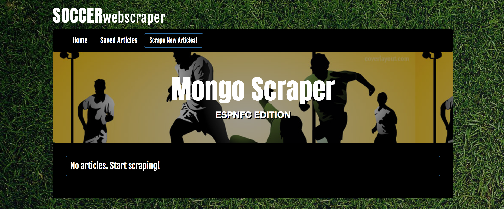
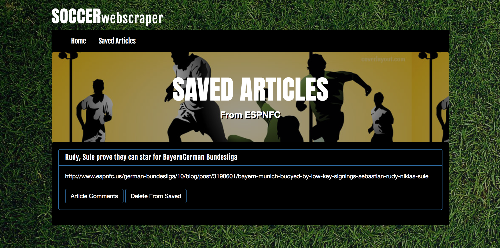

# Scraping the Web

### Overview
By using mongoose and cheerio, this application allows users to leave comments on the top stories in soccer. Users can then save articles in order to leave comments. 

### Preview

### Home Page
  In the home page, you can begin web scraping by using the "Scrape New Articles!"/"New Articles" button. If a previous scraping happened, you will be able to see these articles listed as well. 
  

#### Scraping 
  The web scraping will return a list of top stories from ESPN FC, which can later be saved. 
  

#### Saved Articles Page
  In the Saved Articles page you can comment on an article or unsave a specific article 
  

#### Adding/Deleting Comments
  For each article, the user has the ability to add comments and later delete them
  

